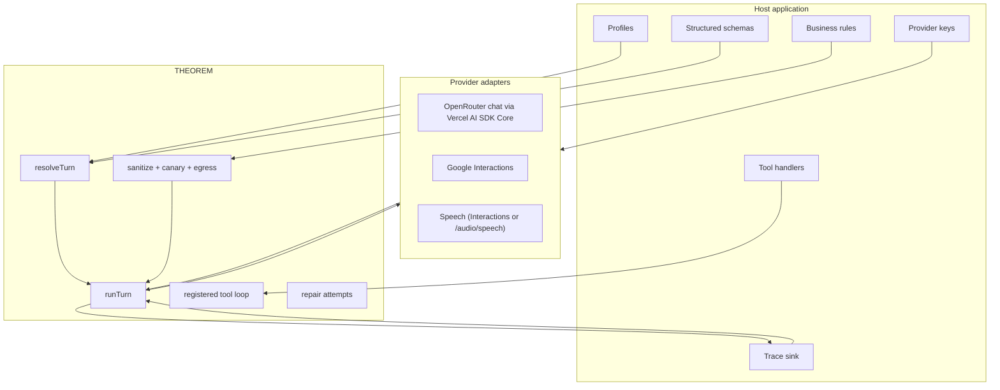
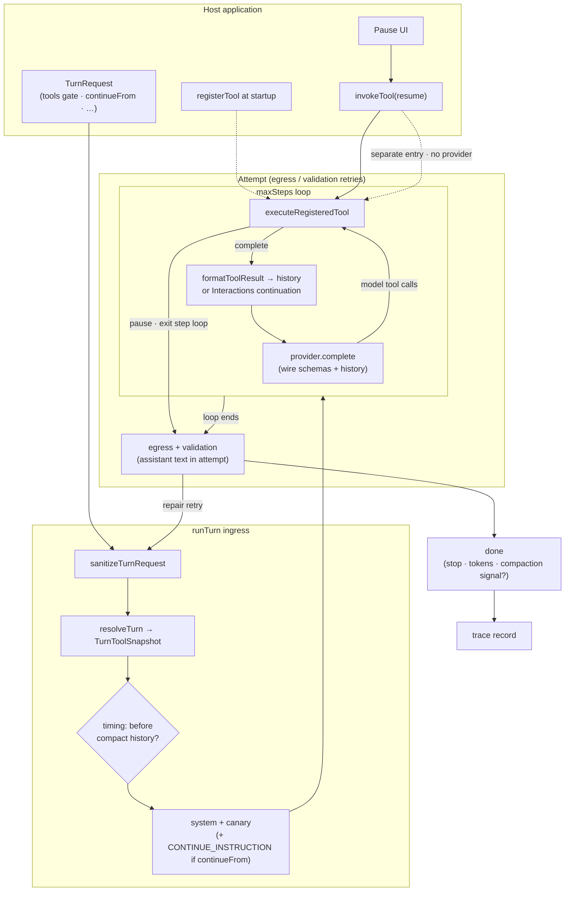

<p align="center">
  <a href="https://github.com/masudl-hub/theoremai">
    <picture>
      <source media="(prefers-color-scheme: dark)" srcset=".github/assets/theorem-logo-dark.svg">
      <source media="(prefers-color-scheme: light)" srcset=".github/assets/theorem-logo-light.svg">
      
    </picture>
  </a>
</p>

<h3 align="center">
  A security-first turn kernel for TypeScript agents.
</h3>

<p align="center">
  Guardrails, egress checks, and tool gating as a strict, stateless runtime —<br>
  on its own, or next to the agent framework you already use.
</p>

<p align="center">
  <a href="#highlights"><strong>Highlights</strong></a> •
  <a href="#where-theorem-fits"><strong>Where it fits</strong></a> •
  <a href="#quickstart"><strong>Quickstart</strong></a> •
  <a href="#registered-tools"><strong>Tools</strong></a> •
  <a href="#guardrails-and-egress"><strong>Guardrails</strong></a> •
  <a href="#provider-adapters"><strong>Providers</strong></a> •
  <a href="#documentation"><strong>Docs</strong></a>
</p>

<p align="center">
  <a href="https://github.com/masudl-hub/theoremai/actions/workflows/ci.yml"></a>
  <a href="https://jsr.io/@theoremai/agents"></a>
  <a href="https://jsr.io/@theoremai/agents/score"></a>
  <a href="https://www.npmjs.com/package/@theoremai/agents"></a>
  <a href="./LICENSE"></a>
</p>

<p align="center">
  <a href="https://github.com/masudl-hub/theoremai/actions/workflows/security.yml"></a>
  <a href="https://github.com/masudl-hub/theoremai/actions/workflows/security.yml"></a>
  <a href="https://github.com/masudl-hub/theoremai/actions/workflows/security.yml"></a>
  <a href="./stryker.guardrails.config.json"></a>
  <a href="./biome.json"></a>
  <a href="./docs/DOCS_TRUTH.md"></a>
</p>

<p align="center">
  
  
  
</p>

## What is THEOREM?

THEOREM is a compact TypeScript **turn kernel**: one runner that executes a single agent turn
deterministically and enforces the contract around it — what comes in, which tools may run,
and what is allowed to leave.

It is deliberately **not** a full agent framework. It ships no memory, no workflow engine, no
RAG, no database, no prompts, and no product policy. Those belong to your application — or to
a framework such as [Mastra](https://mastra.ai), LangGraph.js, or the AI SDK's agent layer.
THEOREM is the strict runtime you reach for when a turn has to be **auditable**: every input
sanitized, every tool call gated, every outbound reply checked, every trace routed where *you*
say.

> **"Profiles describe the contract. Providers move bytes. The runner enforces the turn."**

**Current release: `2.0.0`** — `jsr:@theoremai/agents` · npm `@theoremai/agents`.

## Highlights

### Guard the turn

- 🛡️ **Ingress sanitization** — user text, history, and attachments are normalized, size-limited, and scanned for injection and sensitive data before the model sees them.
- 🐤 **Canary tokens** — a per-turn canary is bound into the system prompt; any leak is caught mid-stream and blocked before bytes reach the client.
- 🚪 **Egress enforcement with repair** — a typed, host-owned egress hook inspects assistant text and can reject back to the model for up to `maxRetries` repair attempts.
- 🧪 **Adversarial by default** — ships an inbound-payload and secrets corpus plus fuzz helpers (`@theoremai/agents/guardrails/testing`) so hosts can attack their own profiles.

### Gate every tool

- 🔐 **Five layers, not one flag** — host catalog → profile allowlist → per-turn opt-in → load-tier visibility (T0/T1/T2) → permission (`auto` · `session_consent` · `always_confirm`).
- ⏸️ **Pause and resume that don't leak authority** — tool pauses resume through `invokeTool`; truncated replies continue through `continueFrom` and must be re-gated by the host. The two paths never mix.
- 🧾 **Zod contracts** — every function tool declares input and output schemas at registration.

### Stay out of your way

- 🧊 **Stateless and ambient-free** — no `.env` reads, no bundled DB, no default trace target. Importing the kernel with every Deno permission denied is a tested invariant.
- 🔌 **One provider door** — `createProvider` routes Google Interactions, OpenRouter (via AI SDK Core), speech, and any local OpenAI-compatible server. Adapters load lazily.
- 📡 **Host-injected traces** — structured trace records go to sinks and destinations you register, with scrub and include policy on the profile.
- 🦕 **Deno-native, npm-ready** — authored for Deno/JSR, published to npm, typed end to end.

## Where THEOREM fits

THEOREM is narrow on purpose. Pick the layer that matches the problem:

| You need… | Reach for | Why |
| :--- | :--- | :--- |
| Agents, workflows, memory, RAG, evals, a dev playground | A full framework (e.g. Mastra) | Batteries included; the fastest path to a product. |
| Provider-agnostic streaming and tool calls, nothing else | Vercel AI SDK | Thin, widely adopted model client. |
| A turn you can **audit** — sanitized input, gated tools, checked egress, host-owned traces | **THEOREM** | The kernel *is* the enforcement boundary; it holds no state and no policy. |
| Both | A framework for orchestration **+** THEOREM for the routes that need strict guarantees | Keep the ecosystem; move the high-risk turns onto a runtime you can reason about. |

THEOREM is a good fit when you run several products on one shared core, when regulated or
private data can appear in a reply, or when you must be able to say exactly which tools a
model could call and where every byte went. If none of that applies, a full framework will get
you further, faster. No framework adapter ships today; THEOREM runs next to one, not inside it.

---

## Quickstart

### Install

#### Deno / JSR

```bash
deno add jsr:@theoremai/agents
```

```ts
import { defineProfile, registerProfile, runTurn } from "jsr:@theoremai/agents";
```

#### npm

```bash
npm install @theoremai/agents
```

```ts
import { defineProfile, registerProfile, runTurn } from "@theoremai/agents";
```

### Minimal example

This example uses a local mock provider so it runs without secrets. Real provider keys should be passed into the provider adapter by the host application.

```ts
import {
  defineProfile,
  registerProfile,
  runTurn,
  type ModelProvider,
  type TurnEvent,
} from "jsr:@theoremai/agents";

const profile = defineProfile({
  type: "text",
  id: "assistant.basic",
  identity: {
    handle: "assistant",
    system: "Answer plainly.",
  },
  model: {
    protocol: "openAi",
    provider: "openrouter",
    allow: ["hostFastModel"],
    config: {
      hostFastModel: {
        apiId: "perplexity/sonar",
        thinking: { on: "high", off: "minimal" },
        thinkingLevels: ["minimal", "low", "medium", "high"],
        summaries: { on: "auto", off: "none" },
        maxOutputTokens: 8192,
        temperature: 1,
        builtInTools: [],
      },
    },
    thinking: "minimal",
    maxSteps: 1,
  },
  tools: { allow: [] },
  inputs: { text: true },
  outputs: {
    streaming: { streamThoughts: false },
  },
  guardrails: {
    quota: { perDay: 100 }, // Optional. Omit when the host owns metering.
  },
});

registerProfile(profile);

const provider: ModelProvider = {
  async *complete(): AsyncIterable<TurnEvent> {
    yield { type: "text", text: "The turn completed." };
    yield { type: "tokens", tokens: { input: 8, output: 4, total: 12 } };
    yield { type: "done" };
  },
};

for await (const event of runTurn(
  { profile: "assistant.basic", input: { text: "Ping" } },
  provider,
)) {
  console.log(event);
}
```

---

## Core Principles

```toml
[kernel_contract]
profiles = "Host-owned declarations for model, inputs, outputs, tools, and guardrails"
runner = "Single deterministic execution path for one agent turn"
providers = "createProvider routes protocol/provider; adapters stay internal"
tools = "Profile allowlist ceiling plus per-turn opt-in gates"
egress = "Typed host hook for outbound disclosure checks and repair loops"
traces = "Profile observability + host-registered destinations; no env vars or bundled DB"

[non_goals]
app_profiles = "No bundled assistants, demos, product personas, or business tasks"
secrets = "No .env files, no ambient key reads in the kernel"
memory_and_workflows = "No session memory, workflow graphs, or RAG; compose those in the host or a framework"
realtime_voice = "Not included yet; persistent duplex sessions stay host-owned"
product_copy = "No channel wording, refusal copy, iMessage/Alexa/Web policy, or UX defaults"
```

OpenRouter chat transport is powered by Vercel AI SDK Core under the adapter. THEOREM keeps the
runner contract, guardrails, tool permissions, egress, media buffering, and trace event shape;
AI SDK handles the OpenRouter request/stream/tool-call normalization layer.

React UI and the headless interface projection remain repo-private under [`react/`](./react/)
and `src/interface/` while their public contracts are being designed. They are excluded from
the JSR and npm packages.

---

## Architecture

THEOREM is organized around a deliberately small execution boundary.



Hosts bind transports with `createProvider(profile, { gemini, openAiGateway })`. One door; protocol/provider (and speech role) pick the adapter.

### Turn execution and tools

One turn is a single pipeline. Tools share `executeRegisteredTool` with `invokeTool`; compaction,
guardrails, and streaming attach at different layers.



**How the verticals meet tools:**

| Vertical | Where it runs | Tool interaction |
| --- | --- | --- |
| **Compaction** | Before turn (`timing: 'before'`) or signal on `done` (`timing: 'after'`) | Summarizes `TurnHistoryMessage` history — including `tool_calls` and `role: 'tool'` rows — not the live registry or mid-turn wire snapshot |
| **Guardrails** | Ingress sanitize; egress/validation after the step loop | Sanitizes user text and history content; tool catalog descriptions and model-emitted arguments are host/registration concerns. Egress inspects assistant **text** in the attempt, not tool progress events |
| **Streaming** | Provider stream + tool handler generators | Provider tool-call events buffer until execution; handler `progress` / `trace` / `artifact` / `warning` phases stream during `executeRegisteredTool`. `streamThoughts: false` filters thoughts only |
| **Resumption** | Two paths — do not mix | **`stop.kind: 'tool'`** → host UI → `invokeTool` with `resume` (skips turn gate). **`length` / `stream_incomplete` / …** → new `runTurn` with `continueFrom` (+ `CONTINUE_INSTRUCTION` in system); host must re-gate tools |

On tool pause the `maxSteps` loop exits (`stop.kind: 'tool'`), egress may still evaluate
buffered assistant text from that attempt, then the turn emits terminal `done`.

---
## Registered Tools

THEOREM separates tool concerns into four layers.

| Layer | Owner | Purpose |
| :--- | :--- | :--- |
| **Catalog** | Host (startup) | `registerTool` — schema, handler, access, loadTier, permission |
| **Allow** | Profile | Custom: `tools.allow`. Builtins: `models.*.builtInTools` |
| **Visibility** | Registry + profile | `loadTier` on tool; T1 via `tools.t1Policy`; T2 via `tools.t2Loader`. Live (`runSession`) wires every allowed tool at setup; `host` profiles execute every allowed tool via `invokeTool`. |
| **Permission** | Host app | `auto`, `session_consent`, and `always_confirm` determine whether execution pauses |

```ts
import { z } from 'zod';
import { registerTool, invokeTool, runTurn } from '@theoremai/agents';

registerTool({
  type: 'function',
  name: 'lookup_order',
  description: 'Fetch order state from the host application.',
  category: 'operations',
  access: 'read-only',
  paths: ['*'],
  loadTier: 'T0',
  permission: 'session_consent',
  input: z.object({ orderId: z.string() }),
  output: z.object({ finding: z.string() }),
  handler: async (input) => ({
    finding: `Order ${input.orderId} is in transit.`,
  }),
});

// Profile allow
tools: { allow: ['lookup_order', 'load_tools'] }

runTurn({ profile, input: { text: '…' } }, provider);

// Gate resume (permission / confirm / auth) — ask_user completes awaiting; answer is a new user turn
invokeTool({ profile, name: 'risky_tool', input: {…}, resume: { granted: true }, snapshot, turnInput });
```

The host owns handlers and authorization state. The kernel enforces the declared contract
via shared `executeRegisteredTool` for model tool calls and `invokeTool` for host resumes.

Function tools require **Zod** input/output schemas at registration time.

**Migration:** [`docs/MIGRATION-tool-system.md`](docs/MIGRATION-tool-system.md) (breaking changes from `dynamicTools` / `ToolEnvelope`).

---

## Guardrails and Egress

Inbound and outbound safety are generic kernel hooks.

```ts
const guardedProfile = defineProfile({
  type: "text",
  id: "assistant.guarded",
  identity: { handle: "guarded", system: "You are a careful assistant." },
  model: {
    protocol: "openAi",
    provider: "openrouter",
    allow: ["hostFastModel"],
    config: {
      hostFastModel: {
        apiId: "perplexity/sonar",
        thinking: { on: "high", off: "minimal" },
        thinkingLevels: ["minimal", "low", "medium", "high"],
        summaries: { on: "auto", off: "none" },
        maxOutputTokens: 8192,
        temperature: 1,
        builtInTools: [],
      },
    },
    thinking: "minimal",
  },
  tools: { allow: [] },
  inputs: { text: true },
  guardrails: {
    egress: {
      onBlock: "reject_to_agent",
      maxRetries: 2,
      enforce: ({ text, canary }) => {
        if (canary && text.includes(canary)) {
          return {
            blocked: true,
            text: "",
            hits: ["canary_token_leak"],
            rejectionMessage: "Remove private runtime tokens from the reply.",
          };
        }
        return { blocked: false, text };
      },
    },
  },
});
```

The egress function is host-owned. One application may block internal tool names, another may block regulated disclosures, and another may disable egress entirely for a trusted development profile.

### How the guardrails are tested

Security claims are only as good as the tests behind them. THEOREM checks its own boundary
several ways:

| Check | What it covers | Where |
| :--- | :--- | :--- |
| Adversarial corpus | Inbound injection payloads and secret shapes, shipped for hosts to reuse | `src/guardrails/corpus/`, `@theoremai/agents/guardrails/testing` |
| Fuzzing | Randomized guardrail and canary inputs through the CLI harness | `tests/cli/fuzz-guardrails.test.ts`, `tests/cli/fuzz-canary.test.ts` |
| Mutation testing | Stryker mutates guardrail, provider, and tool code and requires the suite to kill the mutants (break threshold 75%) | `stryker.guardrails.config.json`, `stryker.config.json`, `stryker.tools.config.json` |
| Static analysis | Semgrep TypeScript + secrets rulesets over `src/`, `mod.ts`, and `scripts/` | `.github/workflows/security.yml` |
| Dependency scanning | Snyk scan of the npm lockfile for high-severity advisories | `.github/workflows/security.yml`, `.snyk` |
| Zero-permission import | The kernel constructs with every Deno permission denied | `tests/kernel/zero-permission-import.test.ts` |

Quota is optional. If a profile omits `guardrails.quota`, the quota helper returns `not_configured` so the host can decide whether that route should be unmetered, rejected, or handled by a separate rate limiter.

---

## Provider Adapters

THEOREM includes provider adapters but does not own credentials. Bind them with one door:

```ts
import { createProvider, runTurn } from "jsr:@theoremai/agents";

const provider = createProvider(profile, {
  gemini: { vault: hostGeminiKeyVault, fetch },
  openAiGateway: { apiKey: hostSecrets.openRouterApiKey },
  // openAi + local — optional; default baseUrl http://127.0.0.1:11434
  local: { baseUrl: hostResolvedLocalBaseUrl },
});

for await (const event of runTurn({ profile: profile.id, input: { text: "…" } }, provider)) {
  // …
}
```

`createProvider` routes from `profile.model.protocol` / `provider`. Speech roles use the same call — Interactions when Google, `/audio/speech` when openAi/openrouter (same `openAiGateway` credentials).

| Profile | Transport |
| :--- | :--- |
| `geminiInteractions` + `google` | Google Interactions (chat, image, speech) |
| `openAi` + `openrouter` (chat) | OpenRouter chat completions |
| `openAi` + `openrouter` (speech role) | OpenRouter `/audio/speech` |
| `openAi` + `local` | Local OpenAI-compatible `/v1/chat/completions` (Ollama, llama.cpp, vLLM, LM Studio, …) |

Local adapters take an optional `baseUrl` (default `http://127.0.0.1:11434`). THEOREM does not read `OLLAMA_HOST`; hosts that honor that env should resolve it and pass `local.baseUrl`. History `parts` (including images) are mapped on the wire; `done` events include a normalized `stop` from the OpenAI `finish_reason`.

OpenRouter uses Vercel AI SDK Core inside THEOREM's provider adapter. Provider
adapters load **lazily on the first `complete` call** for the selected transport —
not when importing THEOREM. Importing `createProvider` alone does not pull in
Google Interactions, OpenRouter/AI SDK, speech, or local adapter graphs.
The OpenRouter adapter still emits THEOREM `TurnEvent` values and preserves raw
provider evidence for citations/provenance where the normalized SDK stream does
not expose enough detail. Use `createProvider` for all turns; adapter modules
stay internal to the providers package.

---

## Public Entrypoints

| Entrypoint | Purpose |
| :--- | :--- |
| `jsr:@theoremai/agents` / `@theoremai/agents` | Main kernel API: profiles, schemas, runner, core types, provider constructors, declarative HTTP/MCP tool execution. |
| `jsr:@theoremai/agents/kernel` / `@theoremai/agents/kernel` | Profile/turn types, tool catalog, `requireModelBinding`, thinking clamps over host model maps. |
| `jsr:@theoremai/agents/providers` / `@theoremai/agents/providers` | `createProvider` + Gemini vault types + host option bags. |
| `jsr:@theoremai/agents/providers/local` / `@theoremai/agents/providers/local` | Direct local OpenAI-compat adapter (`createLocalProvider`, `DEFAULT_LOCAL_BASE_URL`). |
| `jsr:@theoremai/agents/guardrails` / `@theoremai/agents/guardrails` | Sanitization, canary/egress gates, public error mapping, inbound injection/sensitive-data primitives. |
| `jsr:@theoremai/agents/guardrails/testing` / `@theoremai/agents/guardrails/testing` | Adversarial corpus + fuzz helpers (test/harness only). |
| `jsr:@theoremai/agents/observability` / `@theoremai/agents/observability` | Trace sinks and trace record helpers. |
| `jsr:@theoremai/agents/host` / `@theoremai/agents/host` | Optional Deno HTTP helpers (`json`, status mapping, cutout mint flush). |
| `jsr:@theoremai/agents/cli` / `@theoremai/agents/cli` | Profile inspection and stress-test CLI (`agents` binary on npm). |
| `jsr:@theoremai/agents/presets` / `@theoremai/agents/presets` | Optional convenience packs (`registerGooglePreset`, …). |
| `jsr:@theoremai/agents/presets/google` / `@theoremai/agents/presets/google` | Google builtins (search/maps/urlContext/codeExecution) + Interactions/OpenRouter wire metadata. |

Demo fixtures (travel concierge seeds, local handlers) live in the **repo-private**
`@theoremai/playground` package under `playground/` — never published with the kernel.
Hosts that need them link `file:../theorem/playground`.

Internal files remain present in source for maintainability, but package consumers should use the public entrypoints above.

### Exported API

<details>
<summary>Every named export from the root barrel (<code>mod.ts</code>)</summary>

Named exports from the root barrel (same symbols hosts get from `@theoremai/agents` /
`jsr:@theoremai/agents`):

| Group | Symbols |
| --- | --- |
| Guardrails errors | `describeError`, `isAbortError`, `publicError`, `TheoremError`, `throwIfAborted`, `toErrorEvent`, `PUBLIC_CANARY` |
| Network guardrails | `assertSafeUrl`, `isLocalhostName`, `isPrivateOrLocalAddress` |
| Guardrail vocabulary | `AdvisoryLevel`, `TrustLevel`, `GuardrailStage`, `Severity`, `GuardrailHit`, `Verdict`, `GuardrailAction`, `GuardrailContext`, `GuardrailEvent`, `OutboundPayload`, `Provenance`, `ToolOrigin`, `ScanText`, `EgressEnforcer`, `EgressOnBlock`, `ProfileEgressSpec`, `ProfileGuardrailsSpec`, `HostGuardrailsSpec`, `NetworkGuardrailSpec`, `CanaryGuardrailSpec`, `QuotaGuardrailSpec`, `ResolvedGuardrailPolicy`, `DetectionOptions`, `GuardedToolText`, `TurnTaint`, `TaintGate`, `TaintGuardrailSpec`, `TRUST_LEVELS`, `GUARDRAIL_STAGES`, `SEVERITIES`, `TOOL_ORIGINS`, `EGRESS_ON_BLOCK` |
| Guardrail policy | `resolveGuardrailPolicy`, `detectionForTrust`, `detectionForProfile`, `collectEgressHits`, `hitRules`, `EGRESS_RULES`, `runEnforcer` |
| Tool boundary | `guardToolResult`, `guardToolFailureText`, `inspectToolArguments`, `toolCallEvent`, `wrapToolData`, `isRemoteOrigin`, `composeToolText`, `checkTaintGate`, `recordTaint`, `isTainted`, `isSuspicious`, `directiveHits`, `looksDirective`, `advisoryLevel`, `DIRECTIVE_RULES`, `ADVISORY_LEVELS`, `TOOL_CLOSE`, `TOOL_ORIGINS`, `TAINT_GATES`, `textForScan`, `scanTextOf` |
| Quota | `QuotaSlotStatus`, `QuotaExhausted`, `clientIp`, `quotaExhausted`, `releaseSlot`, `resetSlots`, `skipQuota`, `takeSlot` |
| Lexicon | `LEXICON_KEYS`, `LexiconKey`, `LexiconOverrides`, `LexiconParams`, `lexiconDefault`, `lexiconText`, `overrideLexicon`, `resetLexicon` |
| Sanitize | `PROJECT_ID_MAX`, `sanitizeProjectId`, `sanitizeText`, `detectText`, `sanitizeTurnRequest`, `sanitizeTurnRequestWithEvents`, `sanitizeTurnRequestForTrace`, `redactSensitiveOnly`, `guardrailFromHits`, `guardrailFromVerdict`, `guardrailTurnEvent`, `projectGuardrailTurnEvent`, `hitFromSpan`, `matchPreview`, `projectGuardrailEvent`, `GUARDRAIL_MATCH_PREVIEW_MAX` |
| Canary / egress | `mintCanary`, `bindCanary`, `wrapUserData`, `scanTextForCanaryLeak`, `redactCanary`, `OMIT_CANARY`, `createCanaryStreamGate`, `eventHasCanary`, `createCanaryGateSession`, `filterCanaryGatedEvents`, `CanaryGateResult`, `CanaryGateSession`, `CanaryStreamGate`, `standardEgressEnforce`, `createOutboundProgressiveGate`, `createProgressiveYieldGate`, `DEFAULT_HOLDBACK`, `createLiveOutboundGateSession`, `processLiveOutboundBatch`, `finalizeLiveOutboundTurn`, `LiveOutboundBatchResult`, `LiveOutboundGateSession`, `ProgressiveYieldGate`, `ProgressiveYieldGateOptions`, `ProgressiveYieldResult` |
| Compaction | `CompactionSplit`, `CompactionTokens`, `compactionMeter`, `compactionNeeded`, `estimateHistoryTokens`, `HISTORY_MEDIA_TOKENS`, `HISTORY_TEXT_ENCODING`, `resolveCompactionTokens`, `resolveHistoryTokens`, `shouldCompact`, `splitForCompaction` |
| Runner | `runTurn`, `runSession`, `RunSessionOptions`, `prepareLiveInboundText`, `liveIngressEnabled`, `liveIngressEnabledFromSpec`, `liveIngressChannelDefault`, `hasAnyLiveIngress`, `assertLiveIngress`, `assertLiveIngressConfigured`, `LiveIngressChannel` |
| Attachments | `assertAttachmentLimits`, `maxBytesForMime`, `requireMediaLimits`, `resolveMediaLimits`, `sanitizeCsvText`, `sanitizeTurnBlobs`, `sanitizeTurnBlobsForProfile` |
| Catalog | `clampThinkingLevel`, `clampThinkingLevelForApiId`, `mediaChannelForMime`, `MediaInputChannel`, `mediaKindForMime`, `mimeAllowed`, `mimeEssence`, `modelEntryByApiId`, `requireModelBinding` |
| Schema | `PROFILE_FIELDS`, `PROFILE_GRAPH`, `PROFILE_TYPES`, `PROFILE_TYPE_PROTOCOLS`, `protocolsForProfileType`, `isValidProfileProtocol`, `EXTRA_FIELDS`, `fieldMeta`, `catalogPathFor`, `DYNAMIC_FIELD_PARENTS`, `spineFacetsForProfileType`, `profileGraphFacet`, `ProfileGraphFacet`, `ProfileGraphFacetId`, `ProfileGraphEditor`, `ProfileGraphRole`, `PROTOCOLS`, `PROVIDERS`, `PROTOCOL_PROVIDERS`, `providersFor`, `protocolsFor`, `isValidPair`, `coerceProvider`, `coerceProtocol`, `coerceSpeechFormat`, `isSpeechFormatAllowedForProtocol`, `speechFormatsForProtocol`, `THINKING_LEVELS`, `KEY_SLOTS`, `OVERFLOW_KEY_SLOTS`, `MEDIA_INPUT_KINDS`, `MEDIA_INPUT_KIND_VALUES`, `MEDIA_WILDCARDS`, `ATTACHMENT_ACCEPT_MIMES`, `VOICE_ACCEPT_MIMES`, `SUMMARY_MODES`, `STREAM_MODES`, `SPEECH_AUDIO_FORMATS`, `SCHEMA_ENFORCEMENTS`, `COMPACTION_METERS`, `COMPACTION_TIMINGS`, `CACHE_MODES`, `CACHE_TTLS`, `TURN_STAGES`, `TURN_INJECT_STAGES`, `TURN_STOP_KINDS`, `CONTINUE_STOP_KINDS`, `TOOL_GATE_KINDS`, `AWAITING_USER_INPUT_KINDS`, `AWAITING_USER_INPUT_STATUS`, `TOOL_LOAD_TIERS`, `TOOL_ACCESS`, `TOOL_PERMISSION`, `TOOL_TYPES`, `AUTH_UNAUTHENTICATED_POLICIES`, `HTTP_METHODS`, `PLAYGROUND_AUTH_TYPES`, `TOOL_AUTH_TYPES`, `AuthUnauthenticatedPolicy`, `CustomToolType`, `HttpMethod`, `PlaygroundAuthType`, `ToolAccess`, `ToolAuthType`, `ToolPermission`, `ToolType`, `LIVE_ACTIVITY_HANDLINGS`, `LIVE_CONTEXT_COMPRESSIONS`, `LIVE_SPEECH_SENSITIVITIES`, `EGRESS_ON_BLOCK`, `EgressOnBlock` |
| Profiles | `ProfileDefinition`, `ProfileDefinitionBase`, `TextProfileDefinition`, `ImageProfileDefinition`, `SpeechProfileDefinition`, `LiveProfileDefinition`, `HostProfileDefinition`, `clearProfiles`, `defineProfile`, `getProfile`, `hasProfile`, `listProfiles`, `registerProfile`, `registerProfiles`, `projectProfile`, `resolveTurn`, `pickModel` |
| Tools | `registerTool`, `registerTools`, `invokeTool`, `registerHarnessTools`, `getTool`, `hasTool`, `requireTool`, `listTools`, `listBuiltinIds`, `listFunctionIds`, `resetTools`, `formatToolResult`, `prepareTurnToolSnapshot`, `buildHttpToolTarget`, `executeHttpTool`, `executeMcpTool`, `parseMcpRpcResponse`, `isUnsupportedMcpProtocolError`, `MCP_PROTOCOL_VERSIONS`, `McpProtocolVersion`, `resolveToolAuth` |
| Structured | `getStructured`, `registerStructured` |
| Stop / resume | `ProfileTurnBehaviourSpec`, `ProfileTurnResumptionSpec`, `TurnContinueFrom`, `TurnStop`, `TurnStopKind`, `ContinueStopKind`, `CONTINUE_STOP_KINDS`, `AUTO_CONTINUE_DELAY_MS`, `CONTINUE_INSTRUCTION`, `DEFAULT_ALLOW_CONTINUE`, `DEFAULT_AUTO_CONTINUE`, `GenerationStopError`, `isContinueStopKind`, `isGenerationStopError`, `isResumeableStop`, `isUserCancelledStop`, `profileAllowsSteering`, `profileAllowsInject`, `profileTurnResumption`, `shouldAutoContinue`, `turnStopFromClientStreamEnd`, `turnStopFromInteractionStatus`, `turnStopFromOpenAiFinishReason` |
| Stages (target foundation) | `TURN_STAGES`, `TURN_INJECT_STAGES`, `STAGE_AFFORDANCES`, `STAGE_AFFORDANCE_MATRIX`, `TOOL_GATE_KINDS`, `AWAITING_USER_INPUT_KINDS`, `AWAITING_USER_INPUT_STATUS`, `applyStageResult`, `parseAwaitingUserInput`, `parseToolGate`, `isTurnStage`, `isTurnInjectStage`, `isToolGateKind`, `isAwaitingUserInput`, `stageAllowsAffordance`, `stageEventFields`, `profileAllowsInject`, `StageAffordance`, `StageContext`, `StageResult`, `StageMutate`, `StageHandler`, `StageApplyInput`, `StageApplyOutput`, `StageApplyWarning`, `StageApplyWarningCode`, `StageEventExtra`, `AwaitingUserInput`, `ToolGate` — contract [`docs/contracts/stages.md`](docs/contracts/stages.md) |
| Observability | `jsonlSink`, `memorySink`, `noopSink`, `resolveTraceDir`, `sinkFromDir`, `writeTrace`, `registerTraceDestination`, `jsonlDestination`, `requireTraceDestination`, `getTraceDestination`, `listTraceDestinationIds`, `clearTraceDestinations`, `isJsonlTraceDestination`, `isTraceSink`, `resolveTraceWriter`, `resolveObservabilityPolicy`, `TraceRecord`, `TraceSink`, `JsonlSinkOptions`, `JsonlTraceDestination`, `TraceDestination`, `ProfileObservabilitySpec`, `ResolvedObservabilityPolicy`, `ResolvedTraceInclude`, `ResolvedTraceScrub`, `TraceIncludeSpec`, `TraceScrubSpec` |
| Providers | `CreateProviderOptions`, `GeminiTransport`, `KeyVault`, `LocalProviderConfig`, `OpenAiGatewayConfig`, `createProvider` (local: `@theoremai/agents/providers/local` → `createLocalProvider`, `DEFAULT_LOCAL_BASE_URL`) |

</details>

Kernel types re-exported through this barrel follow `export type *` from
`src/kernel/types.ts` (behavioral detail for contributors: repo
`docs/contracts/kernel.md`).

---

## Documentation

THEOREM keeps **package docs** and **repo contracts** separate.

| Surface | What it is | In the published package? |
| --- | --- | --- |
| **This README** | How hosts use THEOREM (API, boundaries, examples) | Yes |
| **Repo contracts** (`docs/contracts/*.md`) | Maintainer ownership + behavioral specs for docs-truth | **No** — GitHub / clone only |
| **Docs-truth** (`docs/DOCS_TRUTH.md`, `docs/_map.mjs`) | Lint graph that enforces those contracts | **No** |

On GitHub, module contracts:

| Doc (repo only) | Export |
| :--- | :--- |
| [`docs/contracts/kernel.md`](docs/contracts/kernel.md) | `@theoremai/agents/kernel` |
| [`docs/contracts/stages.md`](docs/contracts/stages.md) | Turn stages — slices 1–3 landed on branch; release cut when docs match product |
| [`docs/contracts/providers.md`](docs/contracts/providers.md) | `@theoremai/agents/providers` |
| [`docs/contracts/guardrails.md`](docs/contracts/guardrails.md) | `@theoremai/agents/guardrails` |
| [`docs/contracts/observability.md`](docs/contracts/observability.md) | `@theoremai/agents/observability` |
| [`docs/contracts/host.md`](docs/contracts/host.md) | `@theoremai/agents/host` |
| [`docs/contracts/kernel.md`](docs/contracts/kernel.md) (repo-private headless interface) | `src/interface/` |
| [`docs/contracts/cli.md`](docs/contracts/cli.md) | `@theoremai/agents/cli` |
| [`docs/contracts/presets.md`](docs/contracts/presets.md) | `@theoremai/agents/presets` |
| [`docs/contracts/presets-google.md`](docs/contracts/presets-google.md) | `@theoremai/agents/presets/google` |

Migrating from per-turn `dynamicTools`? See
[`docs/MIGRATION-tool-system.md`](docs/MIGRATION-tool-system.md).
Ownership-boundary cut (playground out of package, quota/lexicon/composer)? See
[`docs/MIGRATION-boundary.md`](docs/MIGRATION-boundary.md).

Document health is enforced by `npm run lint:docs` — the **first** step of
`npm run lint` / `deno task lint` (`docs/_map.mjs`):

- Full production-file ownership (`mod.ts`, `src/**/*.ts`, `package.json`, docs-truth scripts)
- Export parity with `package.json` and export-drift vs entry `mod.ts` files
- Doc + **section** freshness on every code change (no Export-only gaming)
- Behavioral sections require `contract_test` evidence (≥2 supports each)
- Publish gates keep `docs/` and `src/**/*.md` out of npm/JSR (`verify-publish-bundle`)
- Freshness diffs use a 32 MiB `git` buffer so large `origin/main...HEAD` patches
  are not silently dropped (`ENOBUFS`)
- Pre-commit runs `lint:docs` automatically (`prepare` installs the hook on `npm install`)

The current branch refresh keeps the package README and the repo contract docs in
step with the live runtime graph: docs-truth validates both the package boundary
and the behavioral sections that changed in the guardrails, kernel, and preset
surface.

---

## Development

```bash
npm install
npm run test
npm run lint
deno install
deno publish --dry-run
npm run build:npm
cd npm && npm pack
```

To dry-run npm publish when the current version is already on the registry, bump to an ephemeral prerelease first (CI does this automatically):

```bash
cd npm
npm version 0.0.0-pr.local --no-git-tag-version
npm publish --dry-run --access public --tag ci-validate
```

PR CI runs JSR and npm dry-run checks in the required `publish-dry-run` job.
Run the security scans locally (CI runs the same checks in the `Security` workflow):

```bash
semgrep scan --config p/typescript --config p/secrets --metrics=off --error \
  --exclude tests --exclude npm --exclude playground --exclude react --exclude tmp \
  src mod.ts scripts
snyk test --file=package-lock.json --severity-threshold=high
npx stryker run stryker.guardrails.config.json
```

Run the packaged CLI locally:

```bash
deno task agents --help
# or after npm install -g / npx:
# npx agents --help
```

Build the npm package from the Deno source (publish only from `npm/`):

```bash
npm run build:npm
cd npm
npm pack
```

Run an OpenRouter provider smoke test with a host-resolved key. The key is passed as an argument and is never read from a Theorem `.env` file.

```bash
deno run --allow-net scripts/verify-provider-smoke.ts --api-key "$OPENROUTER_API_KEY"
```

The default smoke uses `perplexity/sonar` because it is broadly available on OpenRouter. Hosts can override both the profile-facing model id and provider-native id:

```bash
deno run --allow-net scripts/verify-provider-smoke.ts \
  --api-key "$OPENROUTER_API_KEY" \
  --model hostFastModel \
  --api-id perplexity/sonar
```

---

## Package Boundary

THEOREM is ready for host applications when these statements stay true:

```toml
[boundary]
# Rule: "Host decides, Theorem runs."
profiles_in_package = false
demos_in_package = false
env_files_in_package = false
ambient_secret_reads = false
business_logic_in_kernel = false
unownable_user_or_model_copy = false
provider_keys_host_owned = true
provider_adapters_lazy = true
trace_sinks_host_injected = true
realtime_duplex_voice = "out of scope"
```

**Facts vs policy.** Provider facts may ship (model capabilities, wire shapes,
protocol metadata — e.g. `@theoremai/agents/presets/google`). Product policy may not
(prompts, personas, end-user copy, demo apps, channel behavior). Every
user- or model-visible string is either host-supplied or an overridable
registered default in the kernel lexicon (`overrideLexicon`). Behavioral
defaults live as typed profile-schema fields. Optional packages
(`playground/`) are inert extras: deleting them changes no kernel behavior.

Invariant properties (machine-checked where noted):

| Id | Property | Check |
| --- | --- | --- |
| P1 | No ambient authority — construct with every Deno permission denied | `tests/kernel/zero-permission-import.test.ts` |
| P2 | No unownable words — user/model-visible strings are host-suppliable or lexicon defaults | lexicon + full-tree `scripts/docs-truth/copy-lint.mjs` + two-hosts test |
| P3 | No buried policy — behavioral defaults are declared profile-schema fields | `PROFILE_FIELDS` / schema |
| P4 | Inert extras — optional entrypoints removable without behavior change | publish-bundle gate excludes `playground/` |

Provider adapters load **lazily** on the first `complete` for that transport —
`createProvider` and `@theoremai/agents/providers` stay a thin barrel (`src/providers/mod.ts`);
implementation modules (e.g. `google/interactions/`, `openrouter/`, `local/`) are
not pulled in at import time. `trace-attach` lazy-loads Interactions wire helpers
only for `geminiInteractions` traces.

If an app needs domain rules, platform delivery policy, product copy, database access, or session memory, that belongs outside THEOREM.

---

## License

MIT License. Copyright (c) ORCHID AI LLC.

```theorem-evidence
{
  "sections": {
    "Core Principles": {
      "supports": [
        { "kind": "source", "path": "mod.ts" },
        { "kind": "contract_test", "path": "tests/kernel/theorem.test.ts" }
      ]
    },
    "Architecture": {
      "supports": [
        { "kind": "source", "path": "src/kernel/engine/runner.ts" },
        { "kind": "contract_test", "path": "tests/kernel/theorem.test.ts" }
      ]
    },
    "Public Entrypoints": {
      "supports": [
        { "kind": "config", "path": "package.json" },
        { "kind": "contract_test", "path": "scripts/docs-truth/graph.test.mjs" }
      ]
    },
    "Documentation": {
      "supports": [
        { "kind": "graph", "path": "docs/_map.mjs" },
        { "kind": "contract_test", "path": "scripts/docs-truth/graph.test.mjs" }
      ]
    },
    "Package Boundary": {
      "supports": [
        { "kind": "source", "path": "src/providers/mod.ts" },
        { "kind": "source", "path": "src/guardrails/lexicon.ts" },
        { "kind": "contract_test", "path": "tests/kernel/two-hosts-boundary.test.ts" },
        { "kind": "contract_test", "path": "tests/kernel/zero-permission-import.test.ts" }
      ]
    }
  }
}
```
